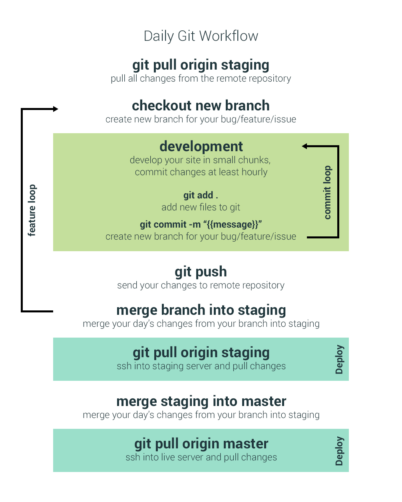

# Creare Git Workflow

Creare's Git workflow is designed to enable version control for all web projects and to work within our web development framework.

A daily workflow has been put together that encourages frequent commits and daily merging when working on new features:

## Rules

1. Pull from staging at the start of the work day
2. Never work directly on staging or master
3. Files containing domain details are ignored
4. The majority of core files are ignored
5. Finished branches must be deleted

## .gitignore

1. Select a relevent .gitignore file for your project, rename it to .gitignore and stick it in the root directory of your project.

## VirtualHost configuration

1. Click the Server Name in MAMP Pro
2. Click the Extended tab
3. Open the revelent file from this repository and place the text within it the "Additional parameters for <VirtualHost>" field.
4. Replace the phrase {PROD} with the staging domain.
